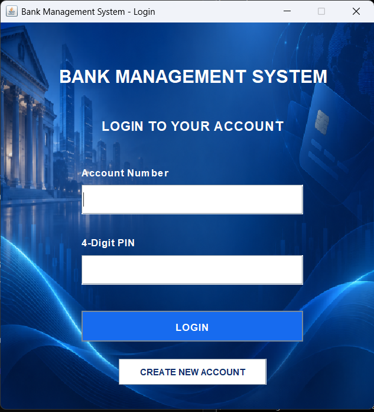
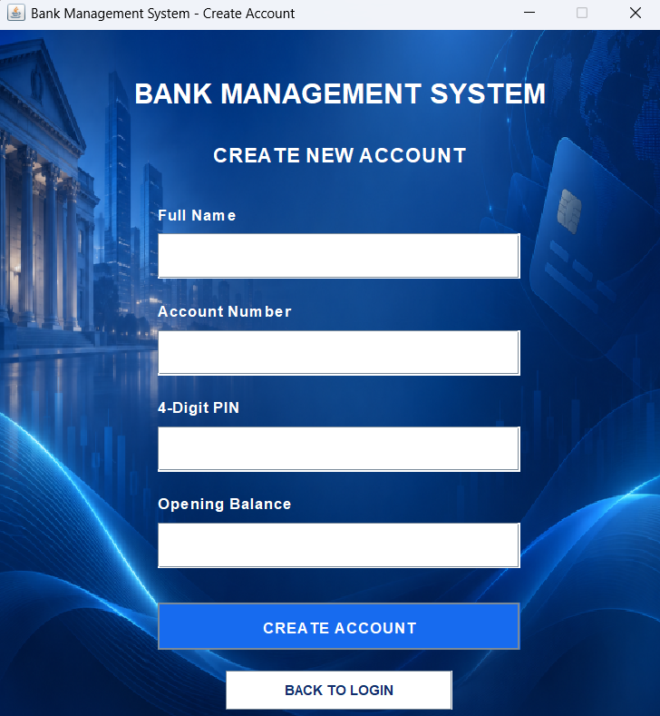
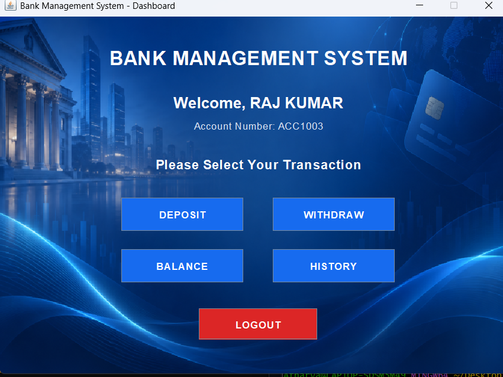
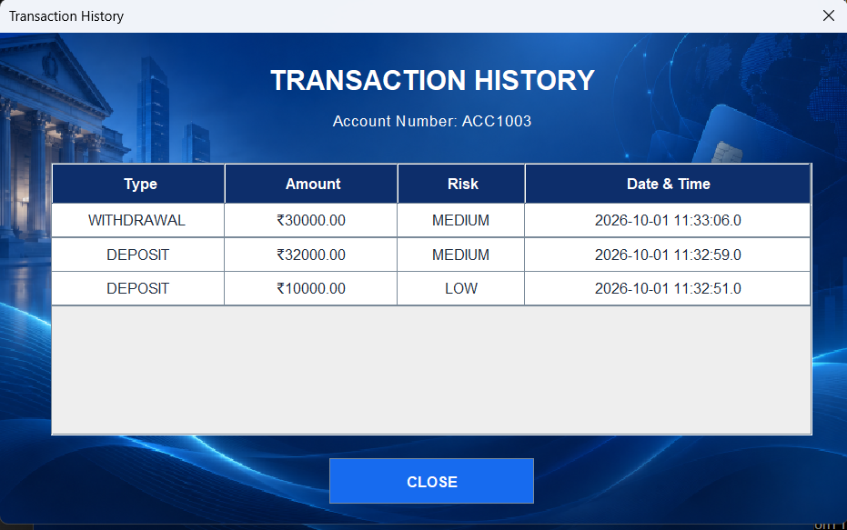

# Bank Management System

A desktop-based Bank Management System developed using **Java Swing, MySQL, JDBC, and Maven**.

The application allows users to create accounts, log in securely, perform banking transactions, check balances, view transaction history, and detect potentially suspicious transactions using a simple rule-based risk system.

---

## Features

- Create a new bank account
- Login using account number and 4-digit PIN
- Temporary account lock after repeated incorrect PIN attempts
- Deposit money
- Withdraw money
- Prevent withdrawals when the balance is insufficient
- Check current account balance
- View transaction history
- Store transaction data in MySQL
- Risk classification for transactions
- Suspicious transaction warning alerts
- Automatic database rollback if a transaction fails
- Java Swing graphical user interface

---

## Screenshots

### Login


### Create Account


### Dashboard


### Transaction History


---

## Transaction Risk Detection

The project includes a simple rule-based transaction risk evaluator.

| Transaction | Risk Level |
|---|---|
| Below ₹25,000 | LOW |
| ₹25,000 or above | MEDIUM |
| Withdrawal of ₹50,000 or above | HIGH |

For medium- and high-risk transactions, the application displays a warning to the user and stores the risk information in the database.

This is a rule-based system and does not use machine learning.

---

## Account Security

The application tracks unsuccessful login attempts.

After **3 incorrect PIN attempts**, the account is temporarily locked for **5 minutes**.

After the lock period expires, the failed-attempt counter is automatically reset.

---

## Technologies Used

- Java 17
- Java Swing
- MySQL
- JDBC
- Maven

---

## Project Structure

```text
bank-management-system/
│
├── database/
│   └── schema.sql
│
├── src/
│   └── main/
│       ├── java/
│       │   └── com/
│       │       └── bankapp/
│       │           ├── Main.java
│       │           │
│       │           ├── dao/
│       │           │   ├── AccountDAO.java
│       │           │   └── TransactionDAO.java
│       │           │
│       │           ├── db/
│       │           │   └── DatabaseConnection.java
│       │           │
│       │           ├── model/
│       │           │   ├── Account.java
│       │           │   └── Transaction.java
│       │           │
│       │           ├── ui/
│       │           │   ├── LoginFrame.java
│       │           │   ├── RegisterFrame.java
│       │           │   └── DashboardFrame.java
│       │           │
│       │           └── util/
│       │               └── RiskEvaluator.java
│       │
│       └── resources/
│           └── images/
│               └── bank_background.png
│
├── .gitignore
├── pom.xml
└── README.md